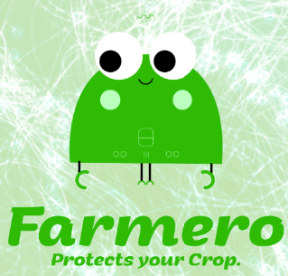

# Farmero App

<p align="center"> 

</p>

Submission by Matthes Krull, Ajay Kumar Mandapati, Kashika Manocha 


## Content

The project is divided into four parts: 0. Dokumentation 1. App (Frontend, Android Studio) 2. Backend (NodeJS, Python) 3. Disease prediction (Tensorflow, Keras, Python) and 4. Docker(Hosting the backend on GCP)

## 0. Dokumentation

Installation instructions, use cases, data for testing, list of devices:

```
https://docs.google.com/document/d/12zU_qe97C54v56L5b--gz6MDRKUx1uSTPHwWqAvEVtQ/edit?usp=sharing
```

Architecture
```
https://docs.google.com/document/d/1ht4LUhrgRNuauB-o0SNxFnezEgDebQo332tsWxCEhZw/edit?usp=sharing
```

Field Risk Prediction Report
```
https://docs.google.com/document/d/1ht4LUhrgRNuauB-o0SNxFnezEgDebQo332tsWxCEhZw/edit?usp=sharing
```

Plant Disease Prediction Report
```
```


## 1. App (Frontend, Android Studio)


The apk file (Please see installation instructions under "dokumentation") is located under:
```
https://drive.google.com/file/d/1L0T9WyWfxgZUjypk5S9C5cAfiQ0s5TNy/view?usp=sharing
```

Android Studio project (just open as existing project in Android Studio):

```
https://drive.google.com/file/d/15kx5okl4lQYOwIX815osJ4Q3o9s2ujC4/view?usp=sharing
```
The relevant Android Studio Java Classes are located under:

```
app/farmero/app/src/main/java/com/example/matthes/farmero
```


## 2. Backend (NodeJS, Python, Google-Cloud)
The contents of the backend can be found in the docker_backed folder:
- Files needed to build the Nodejs server
- Output files from the Nodejs server
- Steps to create the Google-cloud instance and moving docker to the cloud

## 3. Disease prediction (Tensorflow, Keras, Python)
- Navigate to the plant_disease_detection folder to find the ipython notebook which has the description of the Alexnet implemented on the dataset ( Dataset is not uploaded since it is 1.67 GB ).
- Python code for relating diseases with the possible mitigation cases can be found in this folder.

Alexnet model, Mobilenet Model
- Converting this to TF-lite can be found in the folder keras_to_tensorflow
- Converting the Alexnet model to Mobilenet can be found in alexnet_to_mobilenet

## 4. Docker
Docker instructions to build the image can be found in the folder docker_backend:
- Docker_instructions
- Dockerfile
- Please find the pre-built image at this URL:
https://cloud.docker.com/u/akumarmandapati3067/repository/docker/akumarmandapati3067/farmero_final

